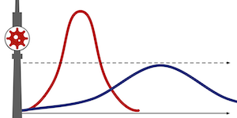

# Coronavirus Cases Scraper for Berlin



This is a scraper for the daily press releases announcing the current Corona/COVID-19 case numbers for Berlin, as issued by the [Senatsverwaltung für Gesundheit, Pflege und Gleichstellung](https://www.berlin.de/sen/gpg/) (Senate Department for Health, Care and Equality). The output of the scraper is a timeline of data extracted from the individual press releases.

## Output Data

The timeline data generated by the scraper is a JSON file in [data/target/berlin_corona_cases.json](data/target/berlin_corona_cases.json), structured as follows:

```json
[
  {
    "source": "https://www.berlin.de/sen/gpg/service/presse/2020/pressemitteilung.941005.php",
    "date": "2020-06-04",
    "counts_per_district": {
      "lor_01": {
        "case_count": 998,
        "incidence": 258.7,
        "recovered": 943
      },
      "lor_02": {
        "case_count": 551,
        "incidence": 189.7,
        "recovered": 509
      },
      ...
      "lor_12": {
        "case_count": 523,
        "incidence": 196.3,
        "recovered": 476
      }
    }
  },
  {
    "source": "https://www.berlin.de/sen/gpg/service/presse/2020/pressemitteilung.940564.php",
    "date": "2020-06-03",
    "counts_per_district": {
      "lor_01": {
        "case_count": 994,
        "incidence": 257.7,
        "recovered": 942
      },
      "lor_02": {
        "case_count": 544,
        "incidence": 187.3,
        "recovered": 507
      },
      ...
      "lor_12": {
        "case_count": 522,
        "incidence": 195.9,
        "recovered": 473
      }
    }
  },
  ...
]
```

The structure of the data is a JSON array with objects for each scraped press release.
Each press release object specifies the `source` (the page that was scraped), the `date` (of the press release) and the `counts_per_district`.
The `counts_per_district` objects are structured with a key for each district, which in turn contain the actual numbers for the total `case_count`, `incidence` and number of `recovered` cases.

The district keys are their [LOR codes](data/manual/lor_district_codes.json) (see the dataset [Lebensweltlich orientierte Räume (LOR) in Berlin](https://daten.berlin.de/datensaetze/lebensweltlich-orientierte-räume-lor-berlin "The dataset 'Lebensweltlich orientierte Räume (LOR) in Berlin' on the Berlin Open Data Portal") for a complete definition of each LOR code):

```json
{
    "lor_01": "Mitte",
    "lor_02": "Friedrichshain-Kreuzberg",
    "lor_03": "Pankow",
    "lor_04": "Charlottenburg-Wilmersdorf",
    "lor_05": "Spandau",
    "lor_06": "Steglitz-Zehlendorf",
    "lor_07": "Tempelhof-Schöneberg",
    "lor_08": "Neukölln",
    "lor_09": "Treptow-Köpenick",
    "lor_10": "Marzahn-Hellersdorf",
    "lor_11": "Lichtenberg",
    "lor_12": "Reinickendorf"
}
```


The press releases also contain counts per age group.
I did not yet get around to adding them to the scraper, but that should be an easy thing to do.
Hopefully, I'll be able to do it soon.

### Manually Extracted Data

Some of the earlier press releases had a slightly different format, or were only available as screen shots (true story), so the scraper did not work for them.
Rather than writing special code for extracting these one- or two-off cases, I manually extracted them and put them in [data/manual/manually_extracted.json](data/manual/manually_extracted.json).
When creating the complete timeline, this manually extracted data is merged with the scraped data.

## Running the Scraper

I will try to update the data regularly, but if you want to run the scraper yourself (to improve it, or because I'm lagging behind the press releases), you can. Here is how:

### Requirements

* Python 3.5+ (required by Scrapy)
* the [Scrapy](https://scrapy.org) Web-scraping framework
* the [jq](https://stedolan.github.io/jq/) JSON processor (for merging the scraped with the manually extracted data).

### Installation

Ideally, you have a Python virtual environment enabled where Scrapy is installed.
To achieve this, follow the [installation guide in the Scrapy documentation](https://docs.scrapy.org/en/latest/intro/install.html).
Once you have done this, you can clone this repository anywhere you like and run the desired make target (see below).

### Make Targets

There is a [Makefile](Makefile) that orchestrates the scraping. The targets should be easy to understand (each one has an `echo` statement that verbosely says what it does).

To create the complete timeline (scraped + manual data), do this:

```
(scrapy) $ make data
scraping corona case numbers from berlin.de ...
writing to data/temp/berlin_corona_cases_scraped.json ...
2020-06-05 14:38:21 [scrapy.utils.log] INFO: Scrapy 2.0.0 started (bot: coronaberlin)

... lots of output from Scrapy ...

2020-06-05 14:38:24 [scrapy.core.engine] INFO: Spider closed (finished)
combining JSON files (data/temp/berlin_corona_cases_scraped.json data/manual/manually_extracted.json) ...
writing to data/target/berlin_corona_cases.json ...
```

## Logo

- [virus](https://fontawesome.com/icons/virus) logo by [FontAwesome](https://fontawesome.com) under [CC BY 4.0](https://creativecommons.org/licenses/by/4.0/).

## License

All software in this repository is published under the [MIT License](LICENSE).

## Disclaimer

I do not make any claims that the data in [data/target/berlin_corona_cases.json](data/target/berlin_corona_cases.json) is correct!
If you find bugs in the code or in the data, please let me know by opening an issue [here](https://github.com/knudmoeller/berlin_corona_cases/issues).

---

2020, Knud Möller

Last changed: 2020-06-05
